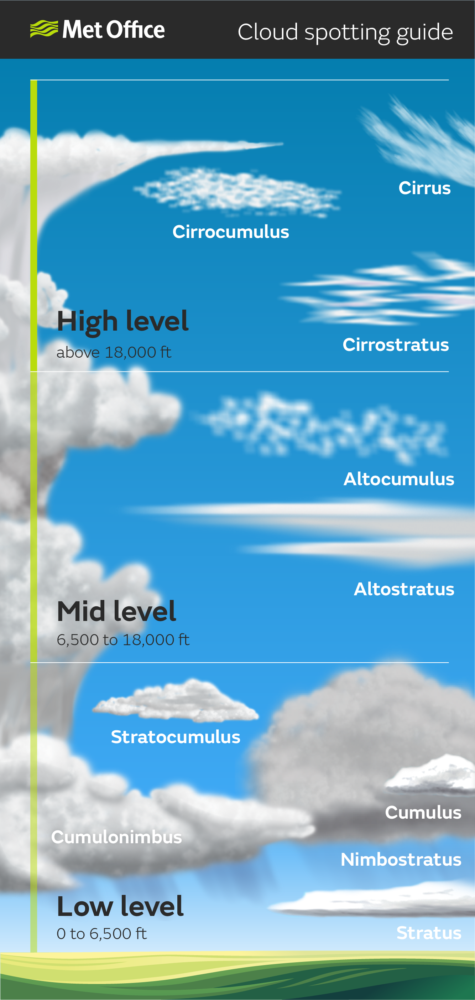

# 050 - Météorologie

## Gradient

Le gradient est :
- De -6.5°/km (ou -2°/1000ft) dans la troposphère.
- Nul dans la basse troposphère entre 11 et 20 km : on dit qu’il y a isothermie.
- De +1°/km dans la partie supérieure de la stratosphère entre 20 et 50 km : on parle d’inversion de température.
- Négatif dans la mésosphère.
- Positif dans la thermosphère.

## Nuages

