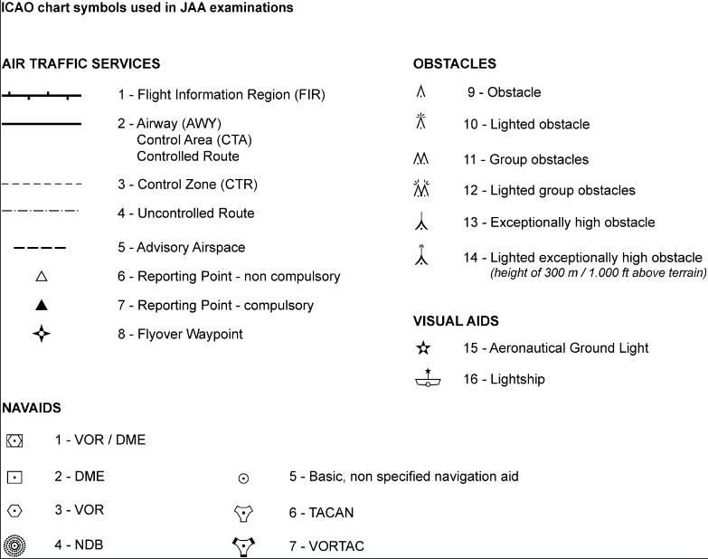

# 061

### Fuel Flow
FF = Q / T 

FF : Fuel Flow
Q : Quantity
T : Time

### ICAO Chart symbols used in JAA examinations

### Consommation distance air :

Cd = Ch / Vp

Cd : Consommation distance
Ch : Consommation horaire
Vp : Vitesse propre

### Cap Compas

Retrancher Votre Dérive, Cela Vous Donne Chaque Mesure du Cap Compas
Rv – X = Cv ; Cv – Dm = Cm ; Cm – d = Cc.

Cc = Rv - Dm - d - X.

Cv : Cap vrai
Cm : Cap magnétique
Cc : Cap compas
Rv : Relèvement vrai
Dm : Déclinaison mmagnétique
d : Déviation compas
X : Dérive

### Distance Point équitemps

Distance au PET = D x Vs retour / (Vs aller + Vs retour).