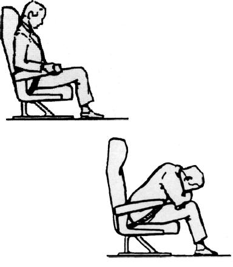

# 070 - Procédures opérationnelles

## Approche
---

Catégorie III B : Une approche de précision aux instruments avec 
- une hauteur de décision inférieure à 50 pieds (15 m) au-dessus de l'élévation de zone de toucher des roues, ou
- sans hauteur de décision et une portée visuelle de piste inférieure à 200 mètres (656 pieds), au moins égale à 75 mètres (246 pieds).

### Visibilité

Catégorie A : MDH 400 ft et visibilité 1500 m.
Catégorie B : MDH 500 ft et visibilité 1600 m.
Catégorie C : MDH 600 ft et visibilité 2400 m.
Catégorie D : MDH 700 ft et visibilité 3600 m.

## Catégorie de poids

H : 136 Tonnes < MMSD : Avions gros porteurs.
M : 7 Tonnes < MMSD < 136 Tonnes : Avions de moyen tonnage.
L : MMSD < 7 Tonnes : Avions de faible tonnage.

## SNOWTAM
---

- Partie F : CONDITIONS SUR TOUTE LA LONGUEUR DE LA PISTE, observées sur chaque tiers de la piste à partir du seuil qui porte le numéro d'identification de piste le plus faible :
  - NIL - PISTE DÉBLAYÉE ET SÈCHE
  - 1 - HUMIDE
  - 2 - MOUILLÉE
  - 3 - GIVRE OU GELÉE BLANCHE (épaisseur normalement moins de 1 mm)
  - 4 - NEIGE SÈCHE
  - 5 - NEIGE MOUILLÉE
  - 6 - NEIGE FONDANTE
  - 7 - GLACE
  - 8 - NEIGE COMPACTÉE
  - 9 - ORNIÈRES OU ARÊTES GELÉE

- Partie J : Congères critiques. Indiquer leur hauteur éventuelle en centimètres et leur distance par rapport au bord de la piste en mètres, suivie des lettres « L » (gauche), « R » (droite) ou « LR » (des deux côtés), l'observation étant faite à partir du seuil qui porte le numéro d'identification de piste le plus faible.

## Position de sécurité
---

Position groupée :
- Ceinture fortement serrée.
- Pieds et genoux joints.
- Pieds bien à plat, fortement appuyés sur le sol.
- Corps penché en avant,
- Bras croisés sur les genoux, tête appuyée sur les avant-bras en intercalant une couverture ou un vêtement.

Cette position est à prendre également par les enfants, toutefois il faudra intercaler une couverture ou un vêtement entre le corps et la ceinture. Cette position n’est pas envisageable pour les femmes enceintes, les personnes de grande taille, les personnes de forte corpulence, les personnes handicapées, les personnes âgées.

Position dressée :

Passagers face à la marche :

- Ceinture fortement serrée.
- Pieds fortement appuyés sur le sol ou sur les attaches du fauteuil.
- Avant-bras et mains appliqués sur les accoudoirs.
- Poser un mouchoir ou une revue sur la poitrine et appuyer fortement le menton sur la poitrine (tête rentrée dans les épaules).

Passagers dos à la marche :

Identique à face à la marche sauf pour la tête qui doit être appuyée fortement contre le dossier ou la cloison, en intercalant au besoin une couverture et serrer fortement le harnais.

La position préférée le plus souvent par les compagnies et à l'examen également est la position groupée.

## Espace RVSM (Reduced Vertical Separation Minima)

Séparation entre FL290 et 2000 ft : 1000 ft

## Abréviations

MDA : Minimum Descent Altitude
MDH : Minimum Descent Height