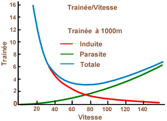

# 081 - Mécanique du vol

### Vitesse de décrochage en fonction de l'inclinaison

La vitesse de décrochage en virage est proportionnelle à la racine carrée du facteur de charge. 
Ce dernier vaut :

1 / cos (inclinaison).

La nouvelle vitesse de décrochage est donc en fonction de l'ancienne: 

$V_s' = V_s * \sqrt\frac{1}{\cos (\text{inclinaison}))}$

### Passage du subsonique au supersonique

Lors du passage du subsonique au supersonique le foyer de l'aile a le même comportement que le centre de poussée. Il reculera de sa position subsonique (25% de la corde) à environ 50% de la corde de profil.

### Tuck Under

Le tuck under est crée par deux phénomènes:
- le recul du centre de poussée en transsonique (distribution de portance rectangulaire) qui accroît le moment piqueur du couple portance/poids.
- la diminution de la déportance de la profondeur (augmentation de son incidence par diminution de la déflexion des filets d'air vers le bas due au décollement de la couche limite derrière l'onde) réduisant le couple cabreur.
Pour lutter contre ce moment piqueur en transsonique les avions sont équipés d'un Mach trim qui va venir diminuer l'incidence du PHR et ainsi augmenter à nouveau la déportance.
En cas de panne du Mach trim il faudra obligatoirement limiter le mach de vol.

### Comment augmenter le nombre de Mach critique ?

L'apparition de vitesses soniques est néfaste. Elles apparaîtront d'autant plus tôt que la survitesse sera importante sur l'extrados. Il faut donc réduire cette survitesse en :
- reculant le maître couple.
- diminuant le rayon du bord d'attaque.
- supprimant la courbure relative.
- diminuant l'épaisseur relative du profil.

### Théorème de Bernoulli

Le théorème de Bernoulli énonce que la somme de la pression statique et de la pression dynamique, soit la pression totale, est constante dans un écoulement de fluide subsonique incompressible.
PSTAT + PDYN = PTOT = constante avec PDYN = (1/2)*rho*TAS².

### Volets de bord d'attaque

Les volets de bord d'attaque ont un effet similaire à celui des becs. A incidence constante, le Cz produit par l'aile ne sera pas modifié (contrairement aux volets qui auraient produit une augmentation de Cz). En revanche, le Czmax et l'incidence critique de l'aile augmenteront fortement.

### Rayon de virage

Le rayon de virage (lors d'un virage coordonné) est donné par l'expression: R = V² / (g x tan(inclinaison)). Il ne dépend donc que de la vitesse et de l'inclinaison.
Tant que ces paramètres restent constants alors le rayon de virage sera le même, peu importe la masse de l'aéronef considéré.
De même le taux de virage w = (g x tan(inclinaison)) / V ne dépendra pas de la masse.

### Types de décrochage

Un avion peut décrocher de trois façons.
- La première est le décrochage basse vitesse lors d'une augmentation d'incidence en palier jusqu'à atteindre l'incidence critique.
- La deuxième est le décrochage haute vitesse, ou par onde de choc, car l'écoulement derrière l'onde est décollé. Si l'aile n'est pas adaptée, l'avion décroche.
- La troisième est le décrochage accéléré, c'est-à-dire sous facteur de charge. Le facteur de charge est suffisamment important pour augmenter la vitesse de décrochage et atteindre la vitesse de vol actuelle.
Le super décrochage est la conséquence du décrochage basse vitesse. L'incidence de l'aile entraîne une perturbation de l'écoulement qui vient frapper la profondeur et la faire décrocher à son tour. L'aile et la profondeur sont décrochées, l'incidence est très élevée, c'est une situation très dangereuse (car rien ne permet de diminuer l'incidence).
Ce genre de situation peut être provoquée par le phénomène d'auto-cabrage propre aux ailes en flèches.

### Trainée 

#### Trainée Induite

La traînée induite est une force de résistance à l'avancement induite par la portance et qui dépend de certaines caractéristiques de l'aile (allongement, forme, flèche etc...).
Le mécanisme de la traînée induite a été théorisé par Ludwig Prandtl (1918). Pour avoir une portance, il faut une surpression relative à l’intrados de l’aile et/ou une dépression relative à l’extrados de l’aile. Sous l'effet de cette différence de pression, l’air passe directement de l’intrados à l’extrados en contournant l'extrémité de l'aile et crée une déviation du flux d'air. 

- Les tourbillons du bord de fuite
- Les tourbillons marginaux
- 

$Rx_i = 1/2 * ρ * V^2 * S * Cx_i$

avec $Cx_i = \frac{Cz^2}{\lambda\pi}$ et $\lambda = \frac{E^2}{S}$

- coefficient de portance  Cz
- allongement  λ
- Envergure de l'aéronef   E

Comme toutes les forces aérodynamiques, la traînée induite dépendra: 
- de la pression dynamique 1/2 ρ V2
- de le surface alaire S
- et d’un coefficient de traînée induite Cxi

#### Trainée Parasite

- Traînée de frottement
- Traînée de forme
- Traînée d'interférence
- Traînée de compressibilité

$Rx_i = 1/2 * ρ * V^2 * S * Cx_i$

Comme toutes les forces aérodynamiques, la traînée induite dépendra: 
- de la pression dynamique 1/2 ρ V2
- de le surface alaire S
- et d’un coefficient de traînée induite Cxi

#### Traînée totale

