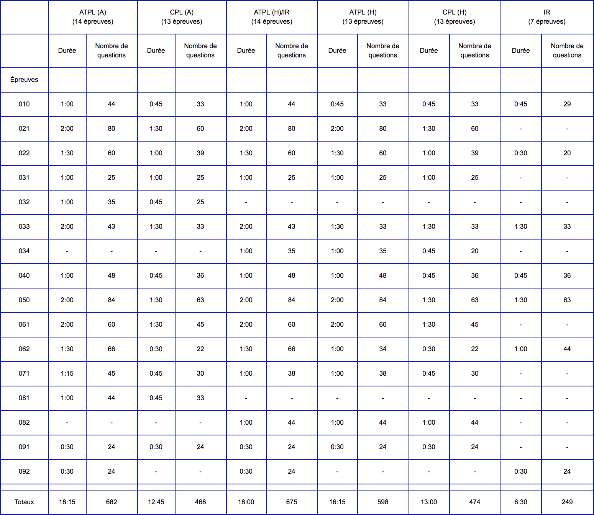

# ATPL

* [010 - Air Law](./010)
* [021 - Cellule et Systèmes, électricité, motorisation et équipements de secours](./021)
* [022 - Instrumentation](./022)
* [031 - Masse et Centrage](./031)
* [032 - Performance](./032)
* [033 - Préparation et Suivi du Vol](./033)
* [040 - Performance humaine et ses limites](./040)
* [050 - Météorologie](./050)
* [061 - Navigation Générale](./061)
* [062 - Radionavigation](./062)
* [070 - Procédures opérationnelles](./070)
* [081 - Mécanique du vol](./081)
* [091 - Communication VFR](./091)
* [092 - Communication IFR](./092)

## Examen

